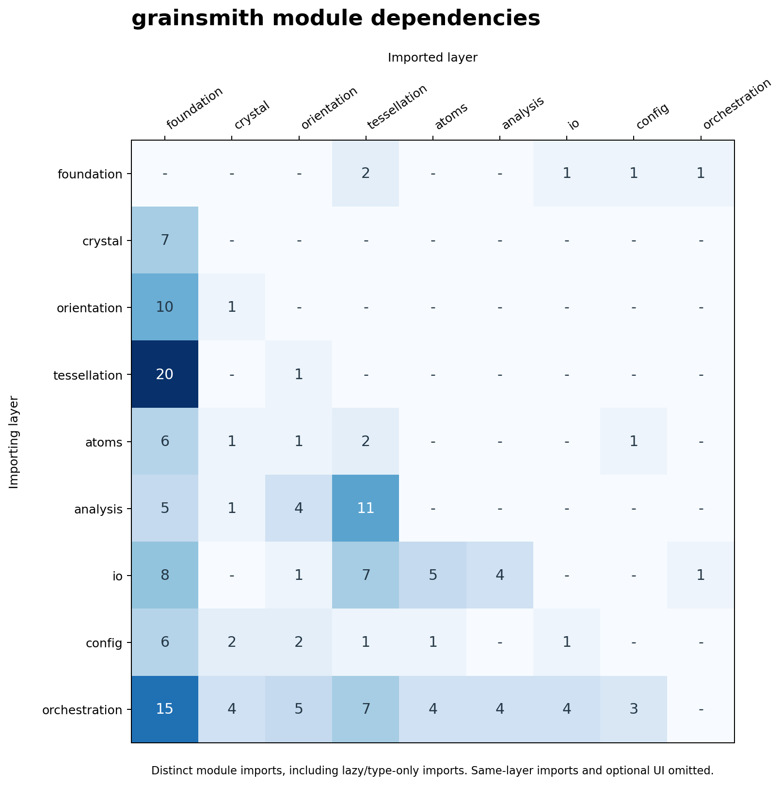

# Architecture

This page explains **how grainsmith works** end-to-end: the stages a run passes
through, the data objects that flow between them, and how the Python package is
organised. It is the map an advanced user (or a developer extending the code)
needs before reading [`developer.md`](developer.md) for the programmatic API or
[`geometry.md`](geometry.md) for the grain-geometry backends.

New to grainsmith? Start with the [user manual](manual.md); come back here when
you want to know *why* a run does what it does.

## 1. The one-paragraph model

grainsmith turns a **declarative YAML config** into a **space-group-aware
atomistic polycrystal** plus a full analysis bundle. A run is a fixed chain of
stages: build the crystal → seed grain centres → partition space into grains
(the *tessellation*) → assign phases and orientations → optionally shape
the boundary-angle distribution → fill each grain
with correctly oriented lattice atoms → remove overlaps at the boundaries →
analyse the microstructure → write the outputs. Every stage is a pure function
of `(inputs, RNG stream)`, so the same seed reproduces the same model
bit-for-bit within the documented environment and configuration scope.
**QA gates** (`G1`–`G26`) — some construction-enforced, some
evaluated and recorded into `summary.csv` — refuse to emit (or flag) a model
that is physically invalid or of uncertain quality — the central design
commitment of the code.

## 2. Pipeline stages and dataflow

`grainsmith.pipeline.run(config)` executes the stage chain and returns a
`RunResult`. The orchestrator only *assembles* stages, collects wall-clock
timings, and runs the gate registry; each stage itself is a self-contained pure
function (`pipeline._stage_*`).

| # | Stage | Module(s) | Produces | Gates evaluated |
|---|-------|-----------|----------|-----------------|
| 1 | **Crystal** | `crystal.cell`, `crystal.spacegroup`, `crystal.verify` | `CrystalData` (cell matrix, symmetry-expanded basis, proper rotations, `d_nn`, densities) | **G2** space-group round-trip |
| 2 | **Seeding** | `seeding` | `(N,3)` grain seed points (Poisson / Lloyd-relaxed) | — |
| 3 | **Tessellation** | `tessellation.*` (incl. `perturbed`) | a `Tessellation` object (grain ownership, adjacency, cell margins) | **G3**–**G6** at construction; **G11** SDOT-fitted volumes; **G13**/**G19**/**G20** (`perturbed_distance` only) |
| 4 | **Phases** (optional, config `phases:`) | `phases` | per-grain phase assignment | **G15** phase volume fractions |
| 5 | **Orientation** | `orientation.samplers`, `orientation.quaternion` | `(N,4)` grain orientation quaternions | **G14** single-crystal box/lattice commensurability |
| 6 | **Angle Shaping** (optional, config `orientation.mdf_target`) | `orientation.mdf`, `orientation.odf` | area-weighted disorientation-angle assignment; optional volume-ODF TV cap | — (**G12** and **G22** are evaluated later on the final network and orientation assignment) |
| 7 | **Fill** | `atoms.fill` | `AtomBlock` (positions, species, grain id) | — |
| 8 | **Overlap** | `atoms.overlap` | `AtomBlock` with boundary overlaps removed | **G7** min-distance |
| 9 | **Doping** (optional, config `doping:`) | `atoms.doping` | `AtomBlock` with substitutional/interstitial dopants inserted | **G17** dopant composition + enrichment, **G18** dopant min-distance |
| 10 | **Analysis** | `analysis.grains`, `analysis.boundaries`, `analysis.statistics`, `analysis.curvature`, `qa` | `GrainReport[]`, `BoundaryReport[]`, statistics | **G3** (voxel), **G8** count, **G9** composition, **G12** angle target, **G16**/**G21** curvature, **G22** ODF drift, **G23** angular/CSL distinction, **G24** final volume targets, **G25** component fidelity, **G26** atom/volume weighting; each conditional on its applicable path |
| 11 | **Write** | `io.*` | LAMMPS data, CSVs, JSON, methods, plots | **G10** LAMMPS round-trip |

Stage numbers are execution order, not source-code phase labels. Seeding
uses box geometry and the configured separation; volume-balanced orientation
components require the FINAL tessellation volumes. Imported voxel fields and
single-crystal builds bypass ordinary seeding. Read the table top-to-bottom
for the ordinary polycrystal path; optional paths are described in the manual.

### Why this order

The dependencies are physical, not incidental:

- **Crystal before everything** — the nearest-neighbour distance `d_nn` computed
  here sets the overlap cutoff used at the fill stage, and the symmetry
  operations are needed both to expand the Wyckoff basis and to reduce
  misorientations to the disorientation (fundamental zone).
- **Seeding before tessellation** — the tessellation *is* a partition of space
  around the seed points; the minimum seed separation also bounds the admissible
  boundary-warp amplitude (`G6`).
- **Tessellation before fill** — the fill asks the tessellation, for each
  candidate lattice point, *which grain owns you?* (`Tessellation.owns`), so the
  partition must exist first.
- **Fill before overlap** — atoms from adjacent grains can land closer than the
  configured cutoff along a boundary; overlap removal (`G7`) enforces that
  geometric separation. It does not establish mechanical equilibrium or
  validate a chosen interatomic potential.
- **Analysis and write last** — they only read the finished model.

## 3. The data objects that flow between stages

Five objects carry state down the chain. Their exact field contracts are in
[`developer.md`](developer.md#3-data-object-contracts); here is what each *is*
and where it comes from.

- **`CrystalData`** (`pipeline.CrystalData`) — the crystal-stage output. Holds
  the `(3,3)` cell matrix `A` (columns are the lattice vectors `a₁,a₂,a₃` in Å),
  the symmetry-expanded `Basis`, the proper point-group rotation quaternions
  `sym_quats`, the spglib verification `dataset` (consumed by `G2`), and the
  derived scalars `d_nn`, `rho_atom`, `density_g_cm3`. For a multiphase run there
  is one `CrystalData` per phase.
- **`Tessellation`** (`tessellation.base.Tessellation`, abstract) — the grain
  partition. Every backend (flat, power, warp, weighted, voxel) implements the
  same six-method interface, so the fill/overlap/analysis stack is
  backend-agnostic. See [`geometry.md`](geometry.md).
- **Orientation quaternions** — an `(N,4)` array, one unit quaternion per grain,
  produced by `orientation.samplers` (random, fiber-textured, ODF-sampled, or
  fixed) and optionally reassigned to shape boundary-angle statistics.
- **`AtomBlock`** (`atoms.fill.AtomBlock`) — the filled model: atom positions,
  per-atom species, and per-atom grain id, sorted by `(grain, generation
  order)`. Overlap removal edits this object in place.
- **`RunResult`** (`pipeline.RunResult`) — the single return value of `run()`,
  bundling the finished `AtomBlock`, the `Tessellation`, the orientation
  quaternions, the grain/boundary reports, the full gate results, the timing
  dict, and the list of files written. This is the object a programmatic caller
  works with; its 18 fields are tabulated in
  [`developer.md`](developer.md#runresult).

## 4. Package structure

The scientific code lives under `src/grainsmith/` in **seven importable
subpackages** plus a set of loose top-level modules and the `ui/` web backend.

| Layer | Subpackage / modules | Responsibility |
|-------|---------------------|----------------|
| Orchestration | `pipeline`, `cli`, `qa` | assemble stages, expose the CLI, run the gate registry |
| Config | `config/` (`schema`, `resolve`, `introspect`) | pydantic schema, YAML→resolved config, schema introspection |
| Crystal | `crystal/` (`cell`, `cif`, `spacegroup`, `pointgroup`, `verify`) | lattice geometry, CIF import, Wyckoff expansion via spglib, space-group verification |
| Orientation | `orientation/` (`quaternion`, `misorientation`, `odf`, `mdf`, `samplers`, `descriptors`) | orientation algebra, volume-weighted texture control, disorientation-angle shaping |
| Tessellation | `tessellation/` (`flat`, `power`, `sdot`, `warp`, `weighted`, `voxel`, `voxel_import`, `perturbed`, `single`, `base`) | all grain-partition backends |
| Atoms | `atoms/` (`fill`, `overlap`, `doping`) | per-grain lattice fill, PBC-aware overlap removal, dopant insertion |
| Analysis | `analysis/` (`grains`, `boundaries`, `statistics`, `curvature`) | grain/boundary reports, publication statistics, GB curvature |
| I/O | `io/` (`lammps`, `xyz`, `reports`, `texture`, `methods`, `gnuplot`, `mesh`, `publication`, `common`) | every output writer + LAMMPS parse-back |
| Foundation | `constants`, `rng`, `seeding`, `phases`, `memory`, `errors`, `provenance` | shared scientific, resource and provenance primitives |

> The `ui/` subpackage is a FastAPI backend for an interactive UI ("grainsmith
> studio") planned for a future release. It is not enabled in this version:
> it is **not** part of the scientific pipeline and is not documented here
> beyond this note, and it only imports the public config and pipeline
> surfaces. It does ship as source — `cli.py` registers a `ui` subcommand —
> but that subcommand only reports that the interactive UI is not included
> in this release; it does not import `grainsmith.ui` or its `fastapi`/
> `uvicorn` dependencies.

## 5. Module dependency graph

The runtime stage order is not the Python import graph. Shared QA types,
configuration validation and lazy imports create edges in both directions
between some aggregated layers, so the static import graph is not a DAG.
The matrix below records the declared imports rather than implying a
topological execution order.

Rows import from columns. The figure and table are generated together by
`python -m tools.gen_module_graph` (Matplotlib is needed only for the PNG).
Lazy and type-only imports count; same-layer imports and the optional UI
are omitted from this scientific-engine overview. Package-level re-exports
count as imports from the named package, not inferred transitive edges.

### Exact subpackage edges

Each cell counts distinct importer-module to imported-module relationships.
The top-level artifact verifier `verify` joins `pipeline`, `cli` and `qa`
under orchestration; the package version and provenance helpers belong to
foundation. A test compares this table with a fresh AST extraction.

<!-- module-dependencies:start -->
| imports from -> | foundation | crystal | orientation | tessellation | atoms | analysis | io | config | orchestration |
|---|---|---|---|---|---|---|---|---|---|
| **foundation** | - | - | - | 2 | - | - | 1 | 1 | 1 |
| **crystal** | 7 | - | - | - | - | - | - | - | - |
| **orientation** | 10 | 1 | - | - | - | - | - | - | - |
| **tessellation** | 20 | - | 1 | - | - | - | - | - | - |
| **atoms** | 6 | 1 | 1 | 2 | - | - | - | 1 | - |
| **analysis** | 5 | 1 | 4 | 11 | - | - | - | - | - |
| **io** | 8 | - | 1 | 7 | 5 | 4 | - | - | 1 |
| **config** | 6 | 2 | 2 | 1 | 1 | - | 1 | - | - |
| **orchestration** | 15 | 4 | 5 | 7 | 4 | 4 | 4 | 3 | - |
<!-- module-dependencies:end -->

## 6. Determinism & the RNG tree

Reproducibility is treated as physics, not polish. A run draws all randomness
from a single seed via `rng.RNGBundle`, which spawns seven independent NumPy
`SeedSequence` streams, one per stochastic stage, in spawn order: `seeding`,
`orientation`, `fields` (domain-warp GRF synthesis), `occupancy`
(stochastic site-occupancy sampling), `sizes` (SDOT log-normal target-volume
sampling), `mdf` (orientation-assignment annealing), and `doping` (dopant
insertion). Because the streams are spawned deterministically from the
root seed, **the same seed produces a bit-identical model** — the atom positions
hash identically across runs (only the output timestamp and the config-hash line
in the LAMMPS header differ). The seed actually used is recorded in
`RunResult.seed`, in `summary.csv`, and in `microstructure.json`, so any model
can be regenerated exactly.

## 7. Where to go next

- **Build a model** → [user manual](manual.md) and [configuration
  reference](config_reference.md)
- **Understand the physics & conventions** → [physics & conventions](physics.md)
- **Choose and tune a grain geometry** → [geometry](geometry.md)
- **Call grainsmith from Python / extend it** → [developer guide](developer.md)
- **Read the QA gates** → [QA gates](gates.md)
- **Interpret the output files** → [outputs](outputs.md)
